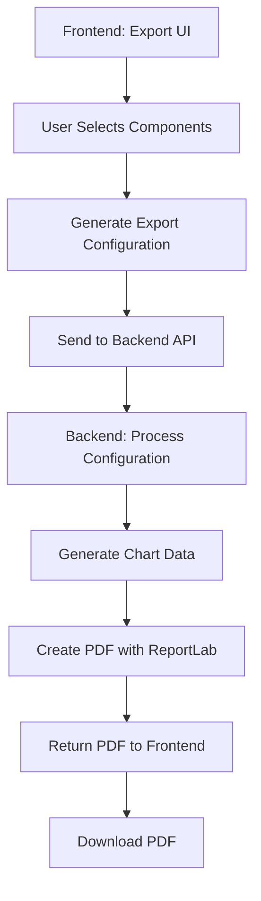

# PDF Export Feature Design

## Overview

This document outlines the design for implementing a comprehensive PDF export feature for the Asset Management Dashboard. The feature will allow users to select specific components and data from the dashboard and generate professional PDF reports.

## Current State Analysis

### Frontend Components Available for Export
- **Summary Cards**: Total Assets, Active, Pending Rebuild, In Stock
- **Charts**: 
  - Assets by Category (Bar Chart)
  - Status Distribution (Pie Chart)
  - Monthly Asset Trends (Area Chart)
  - Warranty Expiration Trends (Bar Chart)
- **Asset Table**: Paginated table with search and filtering
- **Filters**: Company, Manufacturer, Category, Model

### Current Data Structure
```typescript
interface Asset {
  id: number;
  model: string;
  asset_name: string;
  asset_tag: string;
  category: string;
  manufacturer: string | null;
  serial: string | null;
  eol: string | null;
  warranty: string | null;
  location: string | null;
  status: string;
  model_no: string | null;
  company: string | null;
  purchase_date: string;
  created_at: string;
  warranty_expires: string;
}
```

## Design Approach

### Option 1: Backend PDF Generation (Recommended)
**Advantages:**
- Better performance for large datasets
- Consistent formatting
- Server-side processing doesn't block UI
- Can leverage powerful Python PDF libraries
- Better memory management

**Disadvantages:**
- Requires backend changes
- Need to replicate chart logic on backend

### Option 2: Frontend PDF Generation
**Advantages:**
- Leverages existing React components
- Easier to maintain chart consistency
- No backend changes needed

**Disadvantages:**
- Performance issues with large datasets
- Browser memory limitations
- Complex chart-to-PDF conversion

## Recommended Solution: Hybrid Approach

### Architecture Overview



## Implementation Plan

### Phase 1: Export Configuration Interface

#### 1.1 Export Modal Component
Create a modal that allows users to select export options:

```typescript
interface ExportConfig {
  // Report metadata
  title: string;
  description?: string;
  includeFilters: boolean;
  
  // Summary section
  includeSummary: boolean;
  summaryCards: Array<'total' | 'active' | 'pending' | 'stock'>;
  
  // Charts section
  includeCharts: boolean;
  selectedCharts: Array<'category' | 'status' | 'trends' | 'warranty'>;
  
  // Table section
  includeTable: boolean;
  tableColumns: string[];
  tableFilters: {
    company?: string;
    manufacturer?: string;
    category?: string;
    model?: string;
    searchQuery?: string;
  };
  
  // Formatting options
  pageSize: 'A4' | 'Letter';
  orientation: 'portrait' | 'landscape';
  includeTimestamp: boolean;
}
```

#### 1.2 Export Button Integration
Add export button to main dashboard with intuitive placement.

### Phase 2: Backend PDF Generation

#### 2.1 New API Endpoint
```python
@router.post("/assets/export-pdf")
def export_assets_pdf(
    config: ExportConfig,
    session=Depends(get_session)
) -> FileResponse:
    """Generate PDF export based on configuration."""
    pass
```

#### 2.2 PDF Generation Service
Create a dedicated service using ReportLab:

```python
class PDFExportService:
    def __init__(self, assets: List[Asset], config: ExportConfig):
        self.assets = assets
        self.config = config
        
    def generate_pdf(self) -> BytesIO:
        """Generate PDF based on configuration."""
        buffer = BytesIO()
        doc = SimpleDocTemplate(buffer, pagesize=letter)
        story = []
        
        # Add title and metadata
        story.extend(self._build_header())
        
        # Add summary cards if requested
        if self.config.include_summary:
            story.extend(self._build_summary())
            
        # Add charts if requested
        if self.config.include_charts:
            story.extend(self._build_charts())
            
        # Add table if requested
        if self.config.include_table:
            story.extend(self._build_table())
            
        doc.build(story)
        buffer.seek(0)
        return buffer
```

#### 2.3 Chart Generation
Use matplotlib for chart generation that matches frontend styling:

```python
class ChartGenerator:
    @staticmethod
    def generate_category_chart(data: List[Asset]) -> BytesIO:
        """Generate category bar chart."""
        # Group data by category
        category_counts = {}
        for asset in data:
            category = asset.category or 'Unknown'
            category_counts[category] = category_counts.get(category, 0) + 1
        
        # Create matplotlib chart
        fig, ax = plt.subplots(figsize=(10, 6))
        categories = list(category_counts.keys())
        counts = list(category_counts.values())
        
        ax.bar(categories, counts, color='#3b82f6')
        ax.set_title('Assets by Category')
        ax.set_xlabel('Category')
        ax.set_ylabel('Count')
        
        # Save to buffer
        buffer = BytesIO()
        plt.savefig(buffer, format='png', dpi=300, bbox_inches='tight')
        buffer.seek(0)
        plt.close()
        return buffer
```

### Phase 3: Frontend Export UI

#### 3.1 Export Modal Component
```tsx
interface ExportModalProps {
  isOpen: boolean;
  onClose: () => void;
  currentData: Asset[];
  currentFilters: FilterState;
}

export function ExportModal({ isOpen, onClose, currentData, currentFilters }: ExportModalProps) {
  const [config, setConfig] = useState<ExportConfig>({
    title: 'Asset Management Report',
    includeFilters: true,
    includeSummary: true,
    summaryCards: ['total', 'active', 'pending', 'stock'],
    includeCharts: true,
    selectedCharts: ['category', 'status'],
    includeTable: true,
    tableColumns: ['asset_name', 'category', 'manufacturer', 'status'],
    pageSize: 'A4',
    orientation: 'portrait',
    includeTimestamp: true,
  });

  return (
    <Dialog open={isOpen} onOpenChange={onClose}>
      <DialogContent className="max-w-4xl max-h-[80vh] overflow-y-auto">
        <DialogHeader>
          <DialogTitle>Export Report Configuration</DialogTitle>
        </DialogHeader>
        
        <div className="space-y-6">
          {/* Report Settings */}
          <ReportSettingsSection config={config} onChange={setConfig} />
          
          {/* Summary Options */}
          <SummaryOptionsSection config={config} onChange={setConfig} />
          
          {/* Chart Options */}
          <ChartOptionsSection config={config} onChange={setConfig} />
          
          {/* Table Options */}
          <TableOptionsSection config={config} onChange={setConfig} />
          
          {/* Preview */}
          <ExportPreview config={config} data={currentData} />
        </div>
        
        <DialogFooter>
          <Button variant="outline" onClick={onClose}>Cancel</Button>
          <Button onClick={() => handleExport(config)}>
            <Download className="w-4 h-4 mr-2" />
            Generate PDF
          </Button>
        </DialogFooter>
      </DialogContent>
    </Dialog>
  );
}
```

#### 3.2 Export Hook
```tsx
export function useAssetExport() {
  const [isExporting, setIsExporting] = useState(false);
  
  const exportToPDF = async (config: ExportConfig) => {
    setIsExporting(true);
    try {
      const response = await api.post('/assets/export-pdf', config, {
        responseType: 'blob',
      });
      
      // Create download link
      const blob = new Blob([response.data], { type: 'application/pdf' });
      const url = window.URL.createObjectURL(blob);
      const link = document.createElement('a');
      link.href = url;
      link.download = `asset-report-${new Date().toISOString().split('T')[0]}.pdf`;
      link.click();
      
      // Cleanup
      window.URL.revokeObjectURL(url);
    } catch (error) {
      console.error('Export failed:', error);
      throw error;
    } finally {
      setIsExporting(false);
    }
  };
  
  return { exportToPDF, isExporting };
}
```

### Phase 4: Advanced Features

#### 4.1 Template System
```python
class PDFTemplate:
    """Base class for PDF templates."""
    
    def __init__(self, config: ExportConfig):
        self.config = config
        
    def get_styles(self) -> dict:
        """Return styling configuration."""
        return {
            'title': ParagraphStyle(
                'Title',
                fontSize=24,
                spaceAfter=20,
                alignment=1  # CENTER
            ),
            'heading': ParagraphStyle(
                'Heading',
                fontSize=16,
                spaceAfter=12,
                textColor=colors.HexColor('#1f2937')
            ),
            'normal': ParagraphStyle(
                'Normal',
                fontSize=10,
                spaceAfter=6
            )
        }

class ExecutiveSummaryTemplate(PDFTemplate):
    """Template for executive summary reports."""
    pass

class DetailedReportTemplate(PDFTemplate):
    """Template for detailed technical reports."""
    pass
```

#### 4.2 Scheduled Exports
```python
@router.post("/assets/schedule-export")
def schedule_export(
    config: ExportConfig,
    schedule: ScheduleConfig,
    session=Depends(get_session)
):
    """Schedule recurring PDF exports."""
    # Integration with existing scheduler
    pass
```

#### 4.3 Export History
```python
class ExportHistory(SQLModel, table=True):
    id: Optional[int] = Field(default=None, primary_key=True)
    config: str = Field()  # JSON serialized ExportConfig
    created_at: datetime = Field(default_factory=datetime.utcnow)
    file_size: int = Field()
    download_count: int = Field(default=0)
```

## Implementation Steps

### Step 1: Backend Foundation
1. Install PDF generation dependencies
2. Create ExportConfig model
3. Implement basic PDF generation service
4. Create export API endpoint

### Step 2: Frontend Export UI
1. Create export modal component
2. Implement configuration options
3. Add export button to dashboard
4. Create export hook for API integration

### Step 3: Chart Generation
1. Implement matplotlib chart generators
2. Match frontend chart styling
3. Add chart options to configuration

### Step 4: Table Export
1. Implement table generation with ReportLab
2. Add column selection
3. Implement pagination for large datasets

### Step 5: Advanced Features
1. Add multiple templates
2. Implement export history
3. Add scheduled exports
4. Performance optimization

## Technical Considerations

### Performance
- **Pagination**: For large datasets, implement server-side pagination
- **Caching**: Cache chart images for repeated exports
- **Async Processing**: Use background tasks for large exports
- **Memory Management**: Stream large PDFs to avoid memory issues

### Security
- **Input Validation**: Validate all export configurations
- **Rate Limiting**: Prevent abuse of export endpoint
- **File Cleanup**: Auto-delete temporary files
- **Access Control**: Ensure users can only export data they have access to

### User Experience
- **Progress Indicators**: Show export progress for large reports
- **Preview**: Allow users to preview before generating
- **Download Management**: Provide download history
- **Error Handling**: Graceful error messages and retry options

## Dependencies

### Backend
```txt
reportlab==4.0.9
matplotlib==3.8.2
Pillow==10.1.0
```

### Frontend
```json
{
  "html2canvas": "^1.4.1",
  "jspdf": "^2.5.1" // For client-side fallback
}
```

## Testing Strategy

### Unit Tests
- Test PDF generation with various configurations
- Test chart generation accuracy
- Test data filtering and pagination

### Integration Tests
- End-to-end export workflow
- API endpoint testing
- Frontend modal functionality

### Performance Tests
- Large dataset exports
- Memory usage monitoring
- Concurrent export handling

## Future Enhancements

1. **Multiple Formats**: Excel, CSV, Word exports
2. **Email Integration**: Email reports directly
3. **Dashboard Embedding**: Embed charts in external systems
4. **API Access**: Programmatic export access
5. **Custom Branding**: Company logos and styling
6. **Interactive PDFs**: Forms and clickable elements

## Conclusion

This design provides a comprehensive, scalable solution for PDF exports that:
- Gives users full control over what to export
- Maintains professional formatting
- Handles large datasets efficiently
- Provides room for future enhancements
- Integrates seamlessly with existing architecture

The hybrid approach leverages the strengths of both frontend and backend, providing the best user experience while maintaining performance and reliability. 